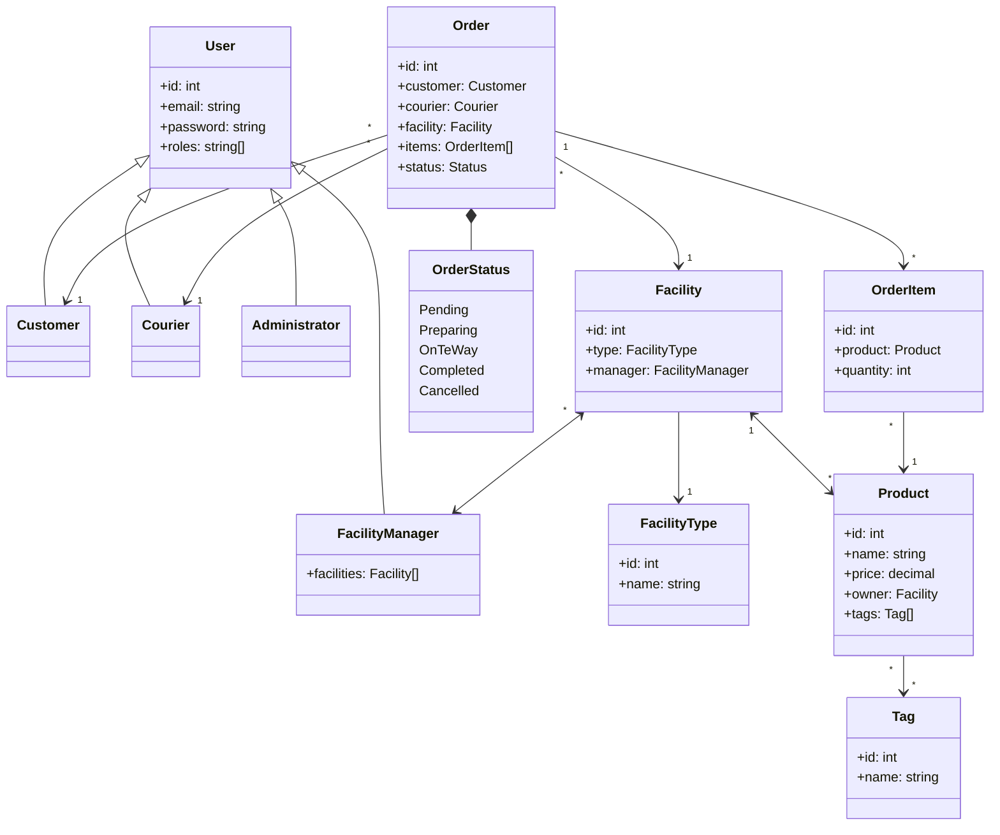

```mermaid
classDiagram
  class User {
    +id: int
    +email: string
    +password: string
    +roles: string[]
  }

  class Customer {
  }

  class Courier {
  }

  class FacilityManager {
    +facilities: Facility[]
  }

  class Administrator {
  }

  class Facility {
    +id: int
    +type: FacilityType
    +manager: FacilityManager
  }

  class FacilityType {
    +id: int
    +name: string
  }

  class Product {
    +id: int
    +name: string
    +price: decimal
    +owner: Facility
    +tags: Tag[]
  }

  class Tag {
    +id: int
    +name: string
  }

  class Order {
    +id: int
    +customer: Customer
    +courier: Courier
    +facility: Facility
    +items: OrderItem[]
    +status: Status
  }

  class OrderStatus {
    Pending
    Preparing
    OnTeWay
    Completed
    Cancelled
  }

  class OrderItem {
    +id: int
    +product: Product
    +quantity: int
  }

  User <|-- Customer
  User <|-- Courier
  User <|-- FacilityManager
  User <|-- Administrator

  Facility "*" <--> "1" FacilityManager
  Facility --> "1" FacilityType
  Facility "1" <--> "*" Product

  Product "*" --> "*" Tag

  Order *-- OrderStatus
  Order "*" --> "1" Customer
  Order "*" --> "1" Courier
  Order "*" --> "1" Facility
  Order "1" --> "*" OrderItem
  OrderItem "*" --> "1" Product
```
